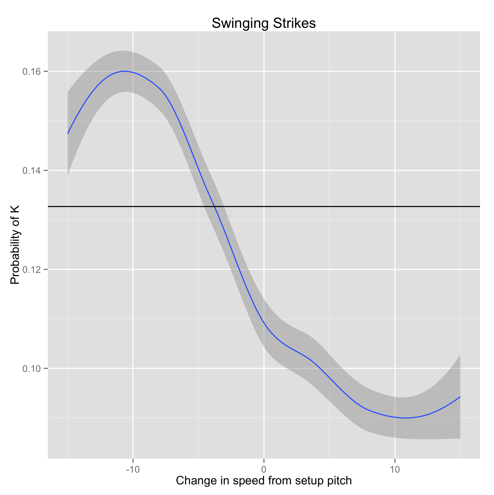

Pitching Strategy Analytics
===========================

Introduction to PitchFx
---------------------------

PitchFx data is generated using tracking cameras installed in every MLB stadium and tracks the flight of the ball from the pitchers hand through the strike zone. Data tracked includes position of the ball, speed, break, and of course outcomes like hits, strikes etc. A proprietary ML algorithm categorizes the pitch type into a range of possible pitches like FF, CH, CU, SL (fourseam fastball, changeup, curveball, slider respectively).

Pitching Strategy
---------------------------

In game seven of the world series, with the tying run on third base and two outs Salvador Perez faced Madison Bumgarner with the game on the line. Bumgarner threw six straight high fastballs out of the strikezone. 

This is an unusual strategy to put it mildly. Even in rock paper scissors, where there are fewer strategic choices available, choosing rock six times in a row is a pretty unusual thing to do. Only one of the six pitches was (barely) in the zone, and besides differences in how far in or out the pitches were, there was hardly any variation in speed, or pitch selection. Nonetheless, this approach was successful when Perez popped up weakly in foul territory to end the game. In the postgame interview, Bumgarner uncharacteristically revealed his strategy.

> I knew Perez was going to want to do something big... We tried to use that aggressiveness and throw our pitches up in the zone. It's a little bit higher than high, I guess, and fortunately I was able to get some past him.

In this case, Bumgarner knew his opponents tendencies and the psychology of the moment and used that knowledge against him masterfully to get an out without throwing a ball that it was possible to put in play.

Such strategic concerns are an underexplored application of PitchFx data. Each at-bat is not only a sequence of independent pitches, but in fact a whole strategic game between pitcher and batter, which may extend back years. Conventional wisdom says that pitchers are most effective when changing speeds, and forcing the hitter to change his eye level by working inside and outside, and up and down in the zone. In fact, OVERALL, this seems to be true. The chart below shows the likelihood of getting a swinging strike based only speed changes, basically the best way to get a swing and miss is to take something off relative to the preceding pitch (ignoring all other factors).

Both the pitcher and batter try to anticipate each others' expectations in order to guess (hitter) or defy (pitcher) expectations of their adversary. Because of this strategic element, the game theory is extremely rich, and pitchers and batters presumably exploit all kinds of information to try and gain an edge in this strategic battle. This information may include, previous at bats against a given adversary, previous pitches in the current at bat, the pitcher's strategy against other hitters. In the Bumgarner vs. Perez atbat, Bumgarner apparently exploited the energy of the scenario, along with an apparently detailed understanding of Perez's tendencies to put away a dangerous hitter with virtually no risk of giving up a hit.

Modeling
---------------------------
In this repository I've created a data set useful for modeling pitching strategy. We begin by creating a data set that includes all pitches and the pitches that preceded them. To begin, I made modelto show the differences among pitches in how likely they are to get a swinging strike.

The above chart shows the probability density of a swinging strike for four different pitches based on the location of the pitch in righty vs. righty scenarios. Not surprisingly, there are big differences here: breaking balls are more effective low in the zone, whereas fourseam fastballs are effective high in the zone. All pitches have a kind of halo around the plate, getting swinging strikes on pitches in the heart of the plate is unlikely, but more likely for changeups, and curveballs, which is not surprising given that these pitches rely more on speed changes than location to deceive the hitter.

But what is the effect of strategy? How does this story change based on setups? A model can capture this by looking at the difference between the overall probability densities and the probability densities associated with a particular setup pitch.

The columns of this grid represent the final pitch of a two pitch sequence, and the rows represent the preceding pitch. Comparing the columns shows how different setup pitches affect the likelihood of a strike for the pitch in that row. While these absolute levels are important, because a pitcher cares about throwing the absolute most effective pitch, it's also interesting to look at the difference between the general behavior and the "set up" behavior, because it tells us something about the strategic game being played between hitter and pitcher.

In this view, the importance of speed would seem to become more apparent. The top row shows the effectiveness of a changeup as a setup pitch. In this row, the green shows that pitches outside the zone are more effective when setup by a changeup. Some of the red zones, where the change in probability of getting a swing and a miss are reduced, seem to be associated with not changing speeds e.g. setting up curves with changeups and vice versa.

A similar approach works for different at-bat outcomes too including called strikes. There are fewer called strikes overall, and as we'll see, the overall evidence for setting up a batter for a called strike ("freezing them") isn't strong (at least, not on the basis of pitch selection alone).

In this chart, aside from some obvious data sparsity issues, there's not much difference within the columns, meaning pretty much that the pitcher has to get it in the halo around the edges of the strikezone to get a called strike, and once that's accomplished, what the last pitch was doesn't make much difference by itself (this is a case where changing locations, moving up/down in/out, might be more important than pitch-selection alone.

The Maestro
----------------------------
Looking here at the overall does shed a little light on how amazing Bumgarner's approach was. Overall, back to back heaters doesn't seem to be a particularly good strategy. Though in this particular case, it obviously was, which is a credit to Bumgarner's mastery of his craft, and perhaps a hint of some of the modeling challenges likely to come up in further work on this data!

What Else To Do
----------------------------

Ultimately a fully comprehensive model should control for handedness of batter and pitcher, count, pitch quality (e.g. break, speed), changes in speed, and individual batter and pitcher characteristics. With such a model in hand, it might be possible to score how lucky or unlucky pitchers are. By seeing which pitchers have the greatest difference between observed and expected outcomes, we might be able to quantify the extent to which pitchers are experiencing a stretch of good or bad luck.

A first-hack at this kind of model should be possible from the data given, take a look at (strategy.R) if you're interested in getting started. Would be happy to accept pull requests with further improvements.